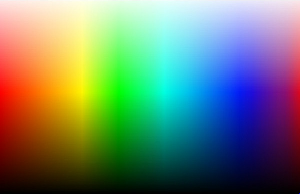
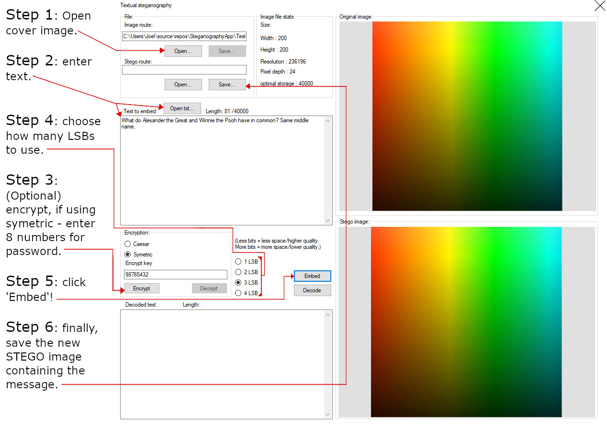
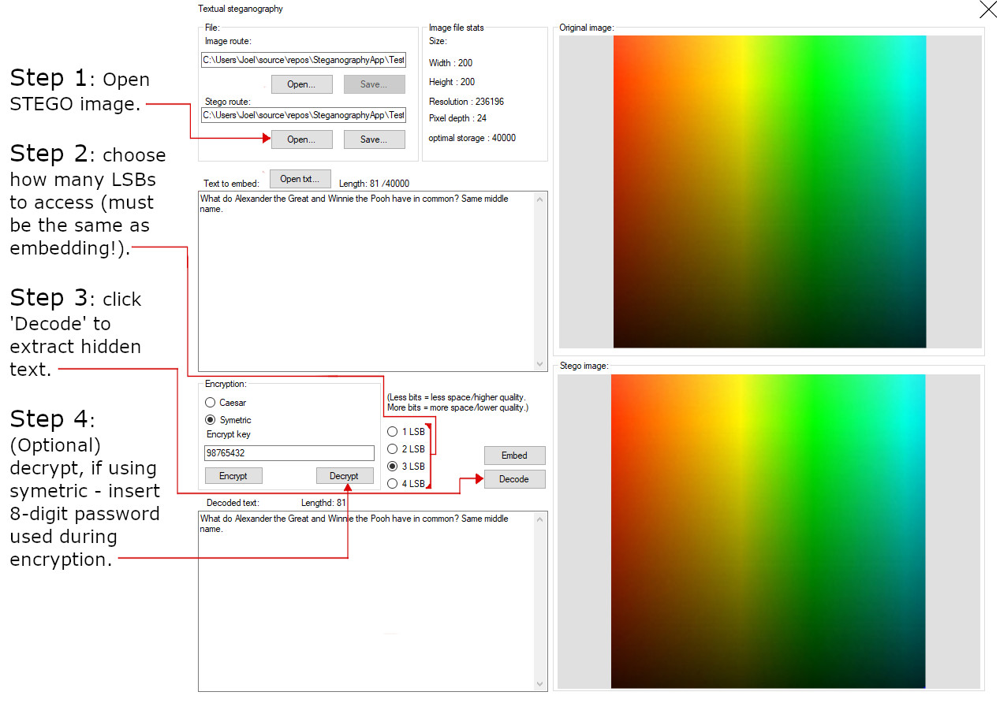

<h1><b>Steganography program</b></h1>

- [Introduction.](#intro)
- [Activity.](#Activity:-1)
- [Installation.](#installation:)
- [Introduction1.](#intro1)
<!-- toc -->

## Intro

Steganography is the practice of concealing a file, message, image, or video within another file, message, image, or video. The word steganography comes from Greek steganographia, which combines the words steganós, meaning "covered or concealed", and -graphia meaning "writing".

<ul>
<li>
This program takes a cover image and allows the user to store text OR an image inside of another image by manipulating the bits of each pixel.
</li>
<li>
User can choose to modify 1/2/3/4 LSB (least significant bit(s)) during text embedding and extraction.
 </li>
<li>
1LSB means less potential storage but less noise (1/255) - 4LSB means more 4x more potential storage than 1LSB but 4x the noise (16/255)
</li>
<li>
Image embed is currently set to 1/2/3 LSB - the extraction can only be performed on 1lsb. I'm working on this but it results in the following requirement: the input image must be 8x smaller than the cover image.
</li>
<li>
I made a YouTube <a href="https://youtu.be/Bgl_wmb9dU0">demonstration</a> for this program but it is slightly outdated now, it's still the same concept though!
</li>
</ul>
## Activity:
</img>

Extract the text (1LSB) from this image and decrypt using symetric alongside this key: '23561287'. :)

## Installation:
<h4>Releases:</h4>

Click 'releases' on the right-hand side of this repo and you can download the .exe file, this may not be the latest version of the project.

<ul><li>Note: my own browser (Microsoft edge) flags this as a potential danger - I assure you it's not but feel free to scan it for yourself. I have reported this issue to Microsoft. :) </li></ul>

Alternatively...

<h4>Zip file:</h4>

## Intro1
<ol>
  <li>Click 'Code' in the top-right.</li>
  <li>select 'Download Zip'.</li>
  <li>This method will require you to compile it using Visual studio.</li>
</ol>
<h2>Tutorial:</h2>
<h4>How do I embed text?</h4>
</img>
<h4>How do I extract my embedded text?</h4>
</img>

<h2>Speed test:</h2>

of course, the speeds will vary depending on your machine but here's how it runs on my PC.</h2>

(embedding 10,000 characters into a 400x400.jpg)

<table>
<tbody>
<tr style="height: 23px;">
<td style="height: 23px;">&nbsp;</td>
<td style="height: 23px;">1LSB</td>
<td style="height: 23px;">2LSB</td>
<td style="height: 23px;">3LSB</td>
<td style="height: 23px;">4LSB</td>
</tr>
<tr style="height: 23px;">
<td style="height: 23px;">Test 1</td>
<td style="height: 23px;">&nbsp;5.064s</td>
<td style="height: 23px;">&nbsp;2.638s</td>
<td style="height: 23px;">&nbsp;1.823s</td>
<td style="height: 23px;">&nbsp;0.082s</td>
</tr>
<tr style="height: 23px;">
<td style="height: 23px;">&nbsp;Test 2</td>
<td style="height: 23px;">&nbsp;4.968s&nbsp;</td>
<td style="height: 23px;">&nbsp;2.676s</td>
<td style="height: 23px;">&nbsp;1.814s&nbsp;</td>
<td style="height: 23px;">&nbsp;0.079s</td>
</tr>
<tr style="height: 23px;">
<td style="height: 23px;">&nbsp;Test 3&nbsp;</td>
<td style="height: 23px;">&nbsp;4.947s&nbsp;</td>
<td style="height: 23px;">&nbsp;2.679s&nbsp;</td>
<td style="height: 23px;">&nbsp;1.830s</td>
<td style="height: 23px;">&nbsp;0.078s</td>
</tr>
<tr style="height: 23px;">
<td style="height: 23px;">&nbsp;Test 4</td>
<td style="height: 23px;">&nbsp;5.098s&nbsp;</td>
<td style="height: 23px;">&nbsp;2.613s</td>
<td style="height: 23px;">&nbsp;1.812s</td>
<td style="height: 23px;">&nbsp;0.080s</td>
</tr>
<tr style="height: 23px;">
<td style="height: 23px;">&nbsp;Test 5</td>
<td style="height: 23px;">&nbsp;5.151s&nbsp;</td>
<td style="height: 23px;">&nbsp;2.765s</td>
<td style="height: 23px;">&nbsp;1.853s&nbsp;</td>
<td style="height: 23px;">&nbsp;0.079s</td>
</tr>
<tr style="height: 23px;">
<td style="height: 23px;">&nbsp;Avg. timing&nbsp;</td>
<td style="height: 23px;">&nbsp;5.045s&nbsp;</td>
<td style="height: 23px;">&nbsp;2.674</td>
<td style="height: 23px;">&nbsp;1.826</td>
<td style="height: 23px;">&nbsp;0.076</td>
</tr>
</tbody>
</table>

<h2>Instructions:</h2>

Instructions can also be found in the program on the about form.

<h4>Embedding</h4>

<i>NOTE: Symetric encryption ONLY works for 1 and 4 LSB.</i>

<ol>
<li>Open your cover image using the &quot;file&quot; section.</li>

<li>Add the text you would like to embed using the &quot;text to embed&quot; box.</li>

<li>Do you want to encrypt the text? if so type in a key and click encrypt.</li>

<li>You must select the amount of LSB you would like to use for the embedding process.</li>

<li>Click 'Embed'.</li>

<li>Click save in the 'stego image' section and select location and name of new stego image.</li>
</ol>

<h4>Extracting</h4>

<i> NOTE: You will notice, if you saved your stego image in the current session, that the 'stego route' box is already filled with your new images directory location.</i>

<ol>
<li>Use the open button under the stego route to select the image you would like to extract a message from.</li>
<li>Select the apropriate amount of LSB which you used to embed the message.</li>
<li>Click &quot;Extract&quot;.</li>
<li>IF you encrypted the string, make sure the key is entered and correct encryption method is selected, click decrypt.</li>
</ol>

<h4>Image embedding</h4>
<i> NOTE: This feature uses 1LSB steganography and therefore your input image must be 8x smaller than your cover image.</i>
<i> UPDATE: the embedding feature now works with 1/2/3/4LSB but the extraction is not yet completed, I will remove these notes once completed, it's slightly more tricky then the embed.</i>
<ol>
<li>Select your cover image.</li>
<li>Select the image you would like to embed.</li>
<li>Click &quot;Embed&quot;.</li>
<li>Save your new stego image using the dialog available.</li>
</ol>

<h4>Image extracting</h4>
<i>Note: As mentioned above, only works for 1LSB at the minute.</i>
<ol>
<li>Select target file (stego image).</li>
<li>Click &quot;Extract&quot;.</li>
<li>Save your extracted image.</li>
</ol>

<h4>Comparison tool</h4>
<ol>
<li> Step 1: Load your first image using the dialog.</li>

<li>Step 2: Load your second image using the dialog.</li>

<li>Step 3: Click &quot;compare&quot;.</li>
</ol>
